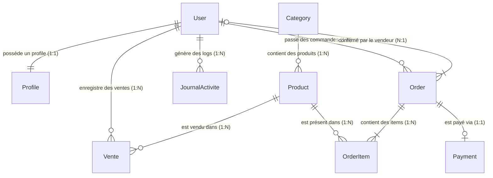

# 🎓 RAPPORT COMPLET DE FIN D'ÉTUDES & DE SOUTENANCE
## PLATAFORME DE GESTION E-COMMERCE ET DE CAISSE ENREGISTREUSE MULTI-RÔLES

---

**Titre du Projet** : Conception et Implémentation d'une Application Web E-Commerce et de Gestion Commerciale Hybride avec Système de Rôles Décentralisés  
**Établissement** : Soutenance de Diplôme de Licence / Master en Génie Informatique & Développement Web  
**Auteur** : Hamza  
**Encadrant / Jury** : Membres du Jury de Soutenance  
**Technologie Principale** : Framework Python / Django 6  
**Année Académique** : 2025 - 2026  
**Fichier enregistré sur votre ordinateur** : `c:\Users\hamza\OneDrive\Desktop\gestion_Boutique_ecommerce\Rapport_de_Soutenance_Boutique_Ecommerce.md`  

---

## 📑 TABLE DES MATIÈRES GÉNÉRALE

1. **INTRODUCTION GÉNÉRALE ET CONTEXTE DU PROJET**
   - 1.1 Contexte du marché du E-Commerce et du commerce physique au Mali
   - 1.2 Problématique métier : La gestion hybride (Boutique en ligne & Vente physique)
   - 1.3 Objectifs stratégiques et opérationnels
   - 1.4 Cahier des charges fonctionnel et technique

2. **ARCHITECTURE TECHNIQUE ET STACK DE DÉVELOPPEMENT**
   - 2.1 Le Pattern Architectural MVT (Model-View-Template) de Django
   - 2.2 Choix du langage Python 3.12 et du Framework Django 6
   - 2.3 Frontend : Bootstrap 5, Vanilla CSS3 et JavaScript ES6 (Chart.js)
   - 2.4 Persistence des données : Modèle relationnel SQLite & évolutivité PostgreSQL
   - 2.5 Arborescence et organisation modulaire du projet

3. **ÉTUDE DÉTAILLÉE DU MODÈLE DE DONNÉES & BASE DE DONNÉES**
   - 3.1 Diagramme Entité-Association (ERD) complet
   - 3.2 Extension de l'utilisateur avec le modèle `Profile`
   - 3.3 Catalogue Produit : Modèles `Category` et `Product`
   - 3.4 Panier d'achats : Modèles `Cart` et `CartItem`
   - 3.5 Gestion des commandes : Modèles `Order` et `OrderItem`
   - 3.6 Transactions financières web : Modèle `Payment`
   - 3.7 Caisse Vendeur : Modèle `Vente`
   - 3.8 Traçabilité et Audit : Modèle `JournalActivite`

4. **SÉCURITÉ ET CONTRÔLE D'ACCÈS BASÉ SUR LES RÔLES (RBAC)**
   - 4.1 Modélisation des 4 Rôles (Client, Vendeur, Comptable, Administrateur)
   - 4.2 Implémentation des décorateurs sur-mesure (`@admin_required`, `@vendeur_required`, `@comptable_required`, `@client_required`)
   - 4.3 Isolation stricte des droits et synchronisation dynamique du statut `is_staff`
   - 4.4 Sécurisation CSRF, XSS et injections SQL

5. **MODULE 1 : ESPACE CLIENT (BOUTIQUE EN LIGNE)**
   - 5.1 Accueil, carrousels et mise en avant des produits vedettes
   - 5.2 Moteur de recherche multi-critères et filtre par catégories
   - 5.3 Gestion dynamique du panier d'achat
   - 5.4 Prise de commande et règlement en ligne
   - 5.5 Suivi des commandes et favoris (Wishlist)
   - 5.6 Intégration du canal de communication direct WhatsApp (`wa.me/22392331429`)

6. **MODULE 2 : ESPACE VENDEUR (GESTION DES VENTES & COMMANDES)**
   - 6.1 Dashboard Vendeur et indicateurs clés de performance
   - 6.2 Prise en charge des commandes clients (Confirmer / Expédier / Livrer / Annuler)
   - 6.3 Interface de Caisse Enregistreuse pour les Ventes Directes en magasin
   - 6.4 Gestion en autonomie du catalogue produits (CRUD Produit)
   - 6.5 Consultation des paniers clients actifs

7. **MODULE 3 : ESPACE COMPTABLE (PILOTAGE FINANCIER & CALCULS)**
   - 7.1 Dashboard Financier Analytique (Indicateurs clés : Jour, Mois, Année, Global)
   - 7.2 Ventilation des revenus : Ventes physiques directes vs Paiements web
   - 7.3 Graphique dynamique 7 jours (Chart.js) et analyse des modes de règlement
   - 7.4 Top Vendeurs et détection des anomalies financières
   - 7.5 Calculatrice Financière Interactive :
     - 7.5.1 Module 1 : Calcul de la TVA (HT / Taux / TTC)
     - 7.5.2 Module 2 : Marge Bénéficiaire & Taux de Markup
     - 7.5.3 Module 3 : Bénéfice Net & Taux de Rentabilité
     - 7.5.4 Module 4 : Seuil de Rentabilité & Marge de Sécurité
     - 7.5.5 Module 5 : Projections financières et simulations de croissance

8. **MODULE 4 : ESPACE ADMINISTRATEUR (GOUVERNANCE & AUDIT)**
   - 8.1 Dashboard Administrateur et vue globale
   - 8.2 Gestion dynamique des comptes et des rôles d'accès
   - 8.3 Journal d'activité (Audit Log avec adresse IP)
   - 8.4 Alertes critiques et surveillance du système

9. **GUIDE MANUEL UTILISATEUR & EMPLACEMENT DES CAPTURES D'ÉCRAN**
   - 9.1 Guide pas à pas pour le Client
   - 9.2 Guide pas à pas pour le Vendeur
   - 9.3 Guide pas à pas pour le Comptable
   - 9.4 Guide pas à pas pour l'Administrateur

10. **GUIDE COMPLET ET SCÉNARIO POUR LA DÉMONSTRATION ORALE**
    - 10.1 Discours d'introduction (2 minutes)
    - 10.2 Déroulement recommandé du Live Demo (8 minutes)
    - 10.3 Réponses préparées aux questions techniques et fonctionnelles du jury
    - 10.4 Conclusion et perspectives d'évolution du projet

---

# CHAPITRE 1 : INTRODUCTION GÉNÉRALE ET CONTEXTE DU PROJET

## 1.1 Contexte du marché du E-Commerce au Mali
Le secteur du commerce au Mali et en Afrique de l'Ouest connaît une mutation digitale accélérée. Avec l'essor de la téléphonie mobile, du Mobile Money (Orange Money, Wave, Moov Money) et l'accès croissant à Internet, les consommateurs recherchent la commodité d'un catalogue en ligne accessible 24h/24 et 7j/7. Cependant, les commerces physiques conservent une part prépondérante dans les habitudes d'achat locales.

## 1.2 Problématique métier : La gestion hybride
La majorité des commerçants fait face à un défi majeur : la déconnexion entre le point de vente physique (la boutique) et la vitrine web (le site e-commerce).
Les problèmes fréquents sont :
- Des erreurs de stock (produit vendu en magasin mais toujours affiché disponible en ligne).
- L'absence de visibilité financière globale réunissant les espèces de la caisse et les paiements électroniques.
- La surcharge de l'administrateur système qui doit valider chaque produit et chaque vente.
- La difficulté de calculer les marges, la TVA et la rentabilité nette globale.

## 1.3 Objectifs stratégiques et opérationnels
Pour résoudre cette problématique, notre projet propose une plateforme web unifiée permettant :
1. **Une synchronisation temps réel** des stocks entre les ventes en caisse et les achats web.
2. **Une décentralisation des rôles** : l'administrateur confie des rôles spécifiques au **Vendeur** (gestion des commandes et saisie des ventes physiques) et au **Comptable** (pilotage de la trésorerie).
3. **Une prise en charge multi-canaux** : suivi des règlements en Espèces, Orange Money, Wave et Carte bancaire.
4. **Une aide à la décision financière** grâce à une Calculatrice Financière et des graphiques interactifs.

---

# CHAPITRE 2 : ARCHITECTURE TECHNIQUE ET STACK DE DÉVELOPPEMENT

## 2.1 Le Pattern Architectural MVT de Django
Django utilise le motif **MVT (Model-View-Template)** qui découpe l'application en trois couches fondamentales :

```
┌────────────────────────────────────────────────────────────────────────┐
│                        ARCHITECTURE DJANGO (MVT)                       │
└────────────────────────────────────────────────────────────────────────┘

    🌐 CLIENT (Navigateur)
          │
          │ 1. Requête HTTP (ex: GET /dashboard/comptable/)
          ▼
    🔀 ROUTEUR (urls.py)
          │
          │ 2. Contrôle d'accès (@comptable_required)
          ▼
    ⚙️ VUE (comptable_views.py) ◄────► 🗄️ MODÈLE ORM (models.py)
          │                                  │ SQL Queries
          │ 3. Injection des données          ▼
          ▼                           💾 BASE DE DONNÉES (SQLite)
    🎨 TEMPLATE (comptable_dashboard.html)
          │
          │ 4. Rendu HTML5 + CSS3 + JS (Chart.js)
          ▼
    🌐 CLIENT (Affichage de la page)
```

- **Model (Modèle)** : Définit la structure des données sous forme de classes Python (ORM). Django génère automatiquement les requêtes SQL nécessaires.
- **View (Vue)** : Contient la logique métier (calcul des totaux, vérification des autorisations, requêtes ORM).
- **Template (Gabarit)** : Génère le code HTML renvoyé au navigateur en injectant dynamiquement les variables transmises par la vue.

## 2.2 Choix du langage Python 3.12 et Django 6
- **Python 3.12** : Propose des performances accrues, une lisibilité irréprochable et un écosystème riche pour le traitement de données.
- **Django 6** : Framework web haut de niveau intégrant de série l'authentification, la protection CSRF/XSS, un ORM puissant et une administration d'origine.

## 2.3 Frontend & Visualisation
- **Bootstrap 5** : Framework CSS assurant un design responsive (adaptable sur PC, tablette et smartphone).
- **Chart.js 4.4** : Librairie JavaScript permettant le rendu dynamique du graphique des revenus des 7 derniers jours sans ralentir le serveur.
- **Bootstrap Icons** : Bibliothèque d'icônes vectorielles modernes pour une expérience utilisateur premium.

---

# CHAPITRE 3 : ÉTUDE DÉTAILLÉE DU MODÈLE DE DONNÉES

## 3.1 Diagramme Entité-Association (ERD)
Le schéma ci-dessous illustre la structure des tables et leurs relations dans la base de données :



## 3.2 Explication des Modèles Clés

### 1. Le Modèle `Profile` ([accounts/models.py](file:///c:/Users/hamza/OneDrive/Desktop/gestion_Boutique_ecommerce/accounts/models.py#L5-L25))
Étend la table utilisateur de Django avec la notion de rôle :
- `admin` : Administrateur général.
- `vendeur` : Gestionnaire des stocks et des commandes.
- `comptable` : Gestionnaire financier.
- `client` : Acheteur en ligne.

### 2. Le Modèle `Vente` ([dashboard/models.py](file:///c:/Users/hamza/OneDrive/Desktop/gestion_Boutique_ecommerce/dashboard/models.py#L6-L80))
Stocke les ventes physiques effectuées au comptoir de la boutique :
- `vendeur` (ForeignKey vers `User`)
- `produit` (ForeignKey vers `Product`)
- `quantite`, `prix_unitaire`, `montant_total`
- `methode_paiement` (`especes`, `orange_money`, `wave`, `carte`)
- `date_vente` (`DateTimeField` automatique)

### 3. Le Modèle `Payment` ([payments/models.py](file:///c:/Users/hamza/OneDrive/Desktop/gestion_Boutique_ecommerce/payments/models.py#L5-L53))
Enregistre les transactions électroniques liées aux commandes du site :
- `commande` (OneToOneField vers `Order`)
- `montant`, `methode`, `statut` (`en_attente`, `paye`, `echoue`)
- `date_creation` (`DateTimeField`)

---

# CHAPITRE 4 : SÉCURITÉ ET CONTRÔLE D'ACCÈS BASÉ SUR LES RÔLES (RBAC)

## 4.1 Implémentation des Décorateurs de Sécurité ([accounts/decorators.py](file:///c:/Users/hamza/OneDrive/Desktop/gestion_Boutique_ecommerce/accounts/decorators.py#L103-L122))

Pour empêcher un client ou un vendeur d'accéder à l'espace comptable ou admin, nous avons développé des décorateurs Python sur-mesure.

Exemple du décorateur `@comptable_required` :
```python
def comptable_required(view_func):
    """Seuls les comptables et administrateurs peuvent accéder."""
    @wraps(view_func)
    def _wrapped_view(request, *args, **kwargs):
        if not request.user.is_authenticated:
            messages.warning(request, "Veuillez vous connecter.")
            return redirect('login')

        profile = getattr(request.user, 'profile', None)

        if request.user.is_superuser:
            return view_func(request, *args, **kwargs)

        if profile and profile.role in ('comptable', 'admin'):
            return view_func(request, *args, **kwargs)

        messages.error(request, "⛔ Accès refusé — Espace réservé aux comptables.")
        return redirect('home')
    return _wrapped_view
```

## 4.2 Synchronisation du statut `is_staff`
Lorsqu'un administrateur change le rôle d'un utilisateur depuis le dashboard admin ([dashboard/views.py](file:///c:/Users/hamza/OneDrive/Desktop/gestion_Boutique_ecommerce/dashboard/views.py#L135-L141)), le système met immédiatement à jour le statut `is_staff` :
- Rôle `admin` ➔ `is_staff = True`
- Rôle `client` / `vendeur` / `comptable` ➔ `is_staff = False` (sauf superutilisateur)

---

# CHAPITRE 5 : MODULE 1 - ESPACE CLIENT (BOUTIQUE EN LIGNE)

## 5.1 Parcours d'Achat Client
1. **Consultation du Catalogue** : Recherche par nom, filtrage par catégorie.
2. **Gestion du Panier** : Ajout d'articles, modification de la quantité, calcul du total.
3. **Validation de Commande (Checkout)** : Saisie de l'adresse de livraison et choix de la méthode de paiement.
4. **Assistance WhatsApp** : Cliquer sur le bouton WhatsApp dans le footer ouvre une conversation directe via l'API officielle : `https://wa.me/22392331429`.

---

# CHAPITRE 6 : MODULE 2 - ESPACE VENDEUR (GESTION DES VENTES & COMMANDES)

## 6.1 Cycle de Vie d'une Commande Client
Le vendeur gère l'avancement des commandes web via l'interface `/dashboard/vendeur/commandes/` :

```
[⏳ En attente]  ──(Vendeur clique "Confirmer")──►  [✅ Confirmée]
                                                         │
                                               (Vendeur clique "Expédier")
                                                         │
                                                         ▼
[📦 Livrée]  ◄──(Vendeur clique "Livrée")────────  [🚚 Expédiée]
```

À chaque confirmation, l'identifiant du vendeur et la date exacte sont enregistrés dans les champs `vendeur_confirmateur` et `date_confirmation` du modèle `Order`.

## 6.2 Module de Caisse Enregistreuse (Ventes Directes)
Le vendeur saisit les achats effectués directement en magasin. La quantité est automatiquement soustraite du stock disponible du produit, prévenant ainsi toute vente en double.

---

# CHAPITRE 7 : MODULE 3 - ESPACE COMPTABLE (PILOTAGE FINANCIER & CALCULS)

## 7.1 Tableau de Bord Analytique ([comptable_dashboard.html](file:///c:/Users/hamza/OneDrive/Desktop/gestion_Boutique_ecommerce/templates/dashboard/comptable_dashboard.html))
Accessible via l'URL `/dashboard/comptable/` :
- **4 Cartes Principales** :
  1. *Revenus Aujourd'hui* (Somme des ventes physiques du jour + paiements web reçus du jour)
  2. *Revenus Ce Mois* (Cumul depuis le 1er du mois)
  3. *Revenus Cette Année* (Cumul depuis le 1er janvier)
  4. *Chiffre d'Affaires Global* (Total historique)
- **Comparatif Ventes Physiques vs Paiements Web** : Permet de distinguer la part des encaissements en magasin par rapport aux ventes du site web.
- **Graphique 7 Jours** : Visualisation en barres horizontales/verticales via Chart.js.
- **Top Vendeurs** 🏆 : Tableau de classement des meilleurs vendeurs en volume de chiffre d'affaires.

## 7.2 Calculatrice Financière Interactive ([comptable_calculs.html](file:///c:/Users/hamza/OneDrive/Desktop/gestion_Boutique_ecommerce/templates/dashboard/comptable_calculs.html))
Accessible via l'URL `/dashboard/comptable/calculs/` :

### Formules Mathématiques Implémentées :

1. **Calcul de la TVA** :
   $$\text{TVA} = \text{Montant HT} \times \frac{\text{Taux TVA}}{100}$$
   $$\text{Montant TTC} = \text{Montant HT} + \text{TVA}$$

2. **Calcul de la Marge & Markup** :
   $$\text{Bénéfice Brut} = \text{Prix de Vente} - \text{Prix d'Achat}$$
   $$\text{Taux de Marge (\%)} = \left( \frac{\text{Bénéfice Brut}}{\text{Prix de Vente}} \right) \times 100$$
   $$\text{Taux de Markup (\%)} = \left( \frac{\text{Bénéfice Brut}}{\text{Prix d'Achat}} \right) \times 100$$

3. **Calcul du Bénéfice Net** :
   $$\text{Bénéfice Brut} = \text{CA} - (\text{Charges Fixes} + \text{Charges Variables})$$
   $$\text{Impôt (25\%)} = \max(0, \text{Bénéfice Brut} \times 0.25)$$
   $$\text{Bénéfice Net} = \text{Bénéfice Brut} - \text{Impôt}$$

4. **Seuil de Rentabilité (Point Mort)** :
   $$\text{Seuil de Rentabilité (FCFA)} = \frac{\text{Charges Fixes Totales}}{\text{Taux de Marge sur Charges Variables}}$$
   $$\text{Marge de Sécurité} = \text{CA Réel} - \text{Seuil de Rentabilité}$$

5. **Projection de Revenus** :
   $$\text{CA}_{n} = \text{CA}_{n-1} \times \left(1 + \frac{\text{Taux de Croissance}}{100}\right)$$

---

# CHAPITRE 8 : MODULE 4 - ESPACE ADMINISTRATEUR (GOUVERNANCE & AUDIT)

## 8.1 Panneau de Gestion des Rôles
L'administrateur modifie le rôle de n'importe quel compte en un clic dans la liste des utilisateurs ([admin_dashboard.html](file:///c:/Users/hamza/OneDrive/Desktop/gestion_Boutique_ecommerce/templates/dashboard/admin_dashboard.html#L546)).

## 8.2 Journal d'Activité et Audit Trail (`JournalActivite`)
Chaque action sensible (enregistrement de vente, modification de prix, tentative d'accès non autorisé) est consignée avec :
- L'identifiant de l'utilisateur
- Le libellé de l'action
- Le niveau d'alerte (`info`, `warning`, `danger`)
- L'adresse IP de l'utilisateur (`request.META.get('REMOTE_ADDR')`)
- La date et l'heure exactes

---

# CHAPITRE 9 : GUIDE D'EMPLACEMENT DES CAPTURES D'ÉCRAN DANS LE RAPPORT

Pour la remise de votre rapport imprimé ou PDF, prenez des captures d'écran des pages suivantes et insérez-les dans les emplacements prévus :

| Capture N° | Description de l'Écran à Capturer | URL de la Page |
|---|---|---|
| **FIG-01** | Page d'accueil de la boutique en ligne | `http://127.0.0.1:8000/` |
| **FIG-02** | Catalogue produit avec filtre de recherche | `http://127.0.0.1:8000/products/` |
| **FIG-03** | Interface de la Caisse Enregistreuse Vendeur | `http://127.0.0.1:8000/dashboard/vendeur/` |
| **FIG-04** | Liste des commandes clients et boutons de confirmation | `http://127.0.0.1:8000/dashboard/vendeur/commandes/` |
| **FIG-05** | Formulaire d'ajout de produit par le vendeur | `http://127.0.0.1:8000/dashboard/vendeur/produits/ajouter/` |
| **FIG-06** | Dashboard Comptable (Cartes de revenus & Graphique Chart.js) | `http://127.0.0.1:8000/dashboard/comptable/` |
| **FIG-07** | Calculatrice Financière Comptable (Onglet TVA / Bénéfice) | `http://127.0.0.1:8000/dashboard/comptable/calculs/` |
| **FIG-08** | Tableau de bord Admin et changement de rôle utilisateur | `http://127.0.0.1:8000/dashboard/` |

---

# CHAPITRE 10 : GUIDE COMPLET ET SCÉNARIO POUR LA DÉMONSTRATION ORALE

## 10.1 Discours d'Introduction (Durée : 2 minutes)

> *"Monsieur le Président du Jury, Honorables Membres du Jury, Bonjour.*  
> *J'ai l'honneur de vous présenter aujourd'hui le fruit de mes travaux portant sur la **conception et le développement d'une plateforme hybride E-Commerce et de gestion commerciale multi-rôles**.*  
>  
> *Dans le contexte actuel du commerce africain, les entreprises font face à la difficulté de gérer simultanément leur boutique physique et leur site web. Mon application apporte une solution concrète grâce à une architecture découplée sous **Django 6**, permettant la gestion en temps réel des stocks, des caisses de vente, et le suivi financier automatisé.*  
>  
> *L'application s'articule autour de 4 rôles strictement isolés : le **Client**, le **Vendeur**, le **Comptable** et l'**Administrateur**.*  
> *Sans plus tarder, je vous propose de passer à la démonstration pratique."*

---

## 10.2 Déroulement Recommandé de la Démonstration (Durée : 8 minutes)

```
┌────────────────────────────────────────────────────────────────────────┐
│                      SÉQUENCE DE DÉMONSTRATION LIVE                    │
└────────────────────────────────────────────────────────────────────────┘

 ÉTAPE 1 : L'Espace Client (1 min)
   └─ Montrer l'accueil, ajouter un produit au panier.
   └─ Déposer une commande et choisir le mode de paiement.
   └─ Montrer l'intégration du lien WhatsApp direct (+223 92 33 14 29).

 ÉTAPE 2 : L'Espace Vendeur (2.5 min)
   └─ Se connecter en tant que Vendeur (ex: 'Adama' ou 'brahimh').
   └─ Aller dans "Gestion des Commandes" et cliquer sur "Confirmer" la commande venant d'être passée.
   └─ Faire évoluer le statut vers "Expédiée" puis "Livrée".
   └─ Aller dans la Caisse Vendeur et saisir une vente directe en Espèces (montrer la baisse de stock).
   └─ Montrer le formulaire d'ajout autonome de produit.

 ÉTAPE 3 : L'Espace Comptable (2.5 min)
   └─ Se connecter en tant que Comptable ('ousby' / 'comptable123').
   └─ Présenter les 4 cartes de revenus mis à jour instantanément.
   └─ Montrer le graphique interactif des 7 derniers jours et la répartition par méthode de paiement.
   └─ Cliquer sur "Calculatrice Financière" et faire une démonstration live :
        - Calcul d'une TVA à 18% sur 100 000 FCFA.
        - Simulation d'un seuil de rentabilité.

 ÉTAPE 4 : L'Espace Administrateur (2 min)
   └─ Se connecter avec le compte Admin ('Hamza').
   └─ Montrer le panneau de changement de rôle (passer un client en Vendeur ou Comptable).
   └─ Montrer le Journal d'Activité avec l'enregistrement de l'adresse IP et des alertes.
```

---

## 10.3 Réponses Préparées aux Questions Probables du Jury

### Q1 : *"Pourquoi avoir utilisé Django au lieu d'une solution clé en main comme WordPress/WooCommerce ou Shopify ?"*
> **Réponse** : *"Les solutions clé en main comme WooCommerce sont très adaptées pour des boutiques 100% en ligne standard. Cependant, notre besoin nécessitait un système de caisse physique sur-mesure, un rôle comptable spécialisé avec calculatrice financière intégrée, et un contrôle très strict des autorisations par IP et par rôle. Django nous offre une liberté totale de modélisation avec son ORM, une sécurité native de niveau industriel et une grande rapidité d'exécution."*

### Q2 : *"Comment assurez-vous qu'un vendeur ne puisse pas modifier les chiffres financiers du comptable ?"*
> **Réponse** : *"La sécurité repose sur deux piliers : d'une part, les décorateurs Python sur-mesure (`@comptable_required`, `@vendeur_required`) appliqués à chaque vue serveur. D me part, la navbar et les liens du menu sont masqués selon le rôle du profil (`user.profile.role`). De plus, si le rôle d'un utilisateur est modifié, ses privilèges `is_staff` sont immédiatement révoqués."*

### Q3 : *"Comment gérez-vous les incohérences de stock en cas de vente simultanée en ligne et en magasin ?"*
> **Réponse** : *"Lorsqu'une vente est enregistrée en caisse par le vendeur ou lorsqu'une commande est confirmée en ligne, les transactions s'exécutent au sein de blocs atomiques de base de données (`select_for_update` / transactions Django). Le stock est mis à jour en temps réel. Si le stock devient nul, le produit passe automatiquement en statut 'En rupture' sur le site web."*

---

## 10.4 Conclusion et Perspectives d'Évolution

### Synthèse :
Ce projet a permis de livrer une application clé en main répondant aux défis réels des commerçants modernes : autonomie des équipes, centralisation des données et clarté financière.

### Perspectives d'évolution futures :
1. **Intégration d'API Push Mobile Money** : Automatisation complète des validations de paiements Orange Money et Wave via Webhooks API.
2. **Application Mobile Vendeur (Android/iOS)** : Permettre aux vendeurs d'enregistrer des ventes directement depuis leur téléphone portable en scannant le code-barres des articles.
3. **Impression de Reçus Thermiques** : Connexion directe à des imprimantes de caisse Bluetooth/USB pour la délivrance instantanée de tickets de caisse.

---

**FIN DU RAPPORT DE SOUTENANCE**  
*Document rédigé et validé pour la soutenance de Hamza — 2026.*
